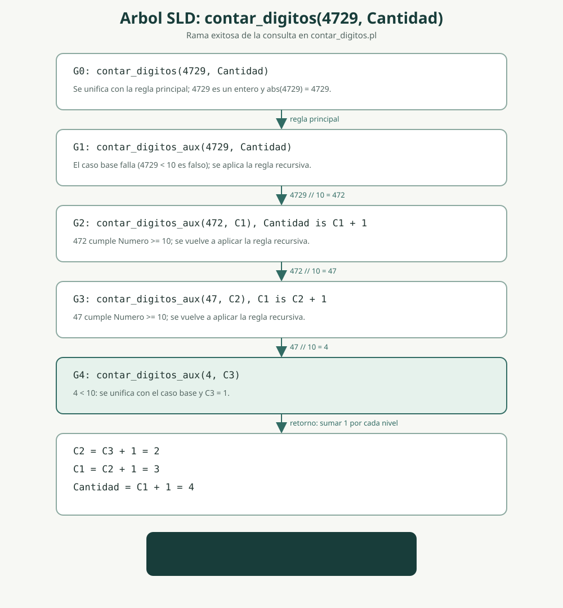

# Laboratorio 3: contar digitos

El archivo [contar_digitos.pl](contar_digitos.pl) define `contar_digitos/2`, que relaciona un numero entero con la cantidad de digitos de su valor absoluto. La recursividad divide el numero entre 10 hasta llegar a un digito; el caso base devuelve 1. Por eso, el signo de un numero negativo no se cuenta y el numero 0 tiene un digito.

## Ejecucion

Desde SWI-Prolog, cargar el programa y consultar:

```prolog
?- [contar_digitos].
true.

?- contar_digitos(4729, Cantidad).
Cantidad = 4.
```

Casos adicionales:

```prolog
?- contar_digitos(0, Cantidad).
Cantidad = 1.

?- contar_digitos(-80, Cantidad).
Cantidad = 2.
```

## Traza y arbol SLD

Para recorrer la resolucion paso a paso, ejecutar en SWI-Prolog:

```prolog
?- trace, contar_digitos(4729, Cantidad).
```

Avanzar con Enter para observar las llamadas, unificaciones, condiciones aritmeticas y retornos. La traza termina con `Cantidad = 4`. El diagrama muestra la rama exitosa: las llamadas recursivas reducen `4729` a `472`, luego a `47` y finalmente a `4`; al regresar, se suma uno por cada division.

### Resultado observado en la traza

Este fragmento resume los pasos principales de la traza compartida para `contar_digitos(4729, Cantidad)`. Se omiten los identificadores internos de las variables y algunas llamadas repetitivas del depurador:

```text
Call: contar_digitos(4729, _)
Call: integer(4729)
Exit: integer(4729)
Call: _ is abs(4729)
Exit: 4729 is abs(4729)
Call: contar_digitos_aux(4729, _)
Call: 4729 < 10
Fail: 4729 < 10
Redo: contar_digitos_aux(4729, _)
Call: 4729 >= 10
Exit: 4729 >= 10
Exit: 472 is 4729 // 10
Call: contar_digitos_aux(472, _)
Call: 472 < 10
Fail: 472 < 10
Redo: contar_digitos_aux(472, _)
Exit: 47 is 472 // 10
Call: contar_digitos_aux(47, _)
Call: 47 < 10
Fail: 47 < 10
Redo: contar_digitos_aux(47, _)
Exit: 4 is 47 // 10
Call: contar_digitos_aux(4, _)
Call: 4 < 10
Exit: 4 < 10
Exit: contar_digitos_aux(4, 1)
Exit: 2 is 1 + 1
Exit: contar_digitos_aux(47, 2)
Exit: 3 is 2 + 1
Exit: contar_digitos_aux(472, 3)
Exit: 4 is 3 + 1
Exit: contar_digitos_aux(4729, 4)
Exit: contar_digitos(4729, 4)

Cantidad = 4.
```

Los `Fail` son esperados: para `4729`, `472` y `47`, la condicion del caso base (`Numero < 10`) falla y Prolog prueba la regla recursiva. Al llegar a `4`, el caso base tiene exito; durante el retorno se suma uno en cada nivel.

